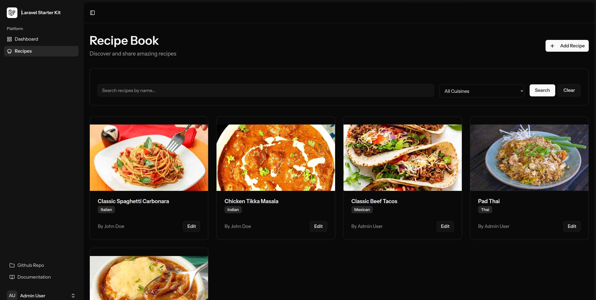
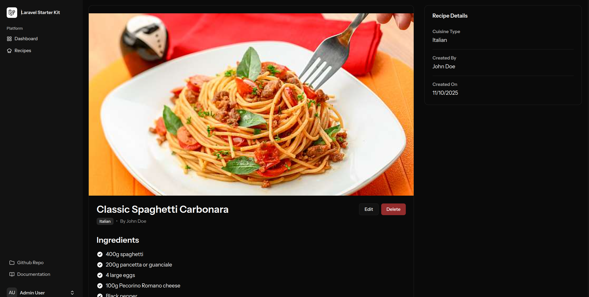
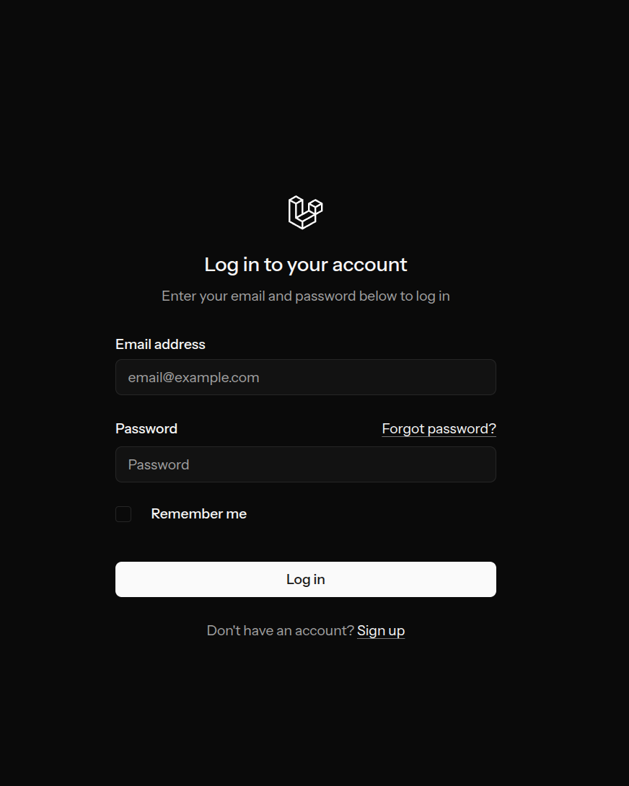

# Recipe Book Application

A full-stack Recipe Book application built with Laravel Sail, Vue 3, and Inertia.js, demonstrating SOLID principles and comprehensive testing.


*Recipe listing with search and filter functionality*


*Detailed recipe view with ingredients and steps*


*Recipe creation form with image upload*

---

## 🚀 Setup Instructions

### Prerequisites
- Docker & Docker Compose
- Git

### Installation

```bash
# 1. Clone the repository
git clone <repository-url>
cd recipe2

# 2. Start Docker containers
./vendor/bin/sail up -d

# 3. Install dependencies
./vendor/bin/sail composer install
./vendor/bin/sail npm install

# 4. Setup database
./vendor/bin/sail artisan migrate:fresh --seed

# 5. Build frontend assets
./vendor/bin/sail npm run dev
```

### Access Application

- **URL**: http://localhost
- **Admin**: admin@example.com / password
- **User**: user@example.com / password

### Run Tests

```bash
./vendor/bin/sail artisan test
# Expected: 28 tests passing
```

---

## 📋 Assignment Requirements

### ✅ Core Features
- **User Management**: Register, Login, Forgot Password, Roles (User/Admin)
- **Recipe CRUD**: Create, Read, Update, Delete with authorization
- **Homepage**: Search, filter by cuisine, pagination, ordered by date

### ✅ Additional Requirements
- **SOLID Principles**: All 5 implemented (SRP, OCP, LSP, ISP, DIP)
- **Separation of Concerns**: 5-layer architecture
- **Testing**: 16 unit tests + 1 E2E test (exceeds 2-3 requirement)

---

## 🏗️ Technical Decisions

### Architecture

**5-Layer Separation of Concerns:**
```
Vue Components (Presentation)
    ↓
Controllers (HTTP)
    ↓
Policies (Authorization)
    ↓
Services (Business Logic)
    ↓
Models (Data)
```

**Why?** Clear separation makes code testable, maintainable, and follows SOLID principles.

### SOLID Implementation

1. **Single Responsibility (SRP)**
   - `RecipeService`: Business logic only
   - `RecipePolicy`: Authorization only
   - `RecipeController`: HTTP handling only
   - `StoreRecipeRequest`/`UpdateRecipeRequest`: Validation only

2. **Open/Closed (OCP)**
   - Policies and services can be extended without modification
   - New features don't require changing existing code

3. **Liskov Substitution (LSP)**
   - Services are interchangeable
   - Controller depends on abstractions

4. **Interface Segregation (ISP)**
   - Focused interfaces with only necessary methods
   - No bloated classes

5. **Dependency Inversion (DIP)**
   - Controller uses dependency injection
   - Depends on abstractions, not concrete implementations

### Technology Stack

| Layer | Technology | Reason |
|-------|-----------|--------|
| Backend | Laravel 11 | Modern PHP framework, excellent ORM |
| Frontend | Vue 3 + TypeScript | Reactive, type-safe, component-based |
| Bridge | Inertia.js | SPA without API complexity |
| Database | MySQL | Reliable, well-supported |
| Container | Docker Sail | Consistent dev environment |
| Testing | PHPUnit | Laravel standard, comprehensive |

### Key Design Decisions

**1. Service Layer Pattern**
- Extracted business logic from controllers
- Makes code testable in isolation
- Follows SRP and DIP

**2. Policy-Based Authorization**
- Centralized access control
- Reusable across application
- Easy to test and maintain

**3. Form Request Validation**
- Separates validation from controllers
- Reusable validation rules
- Follows SRP

**4. Factory Pattern for Testing**
- Generates test data consistently
- Makes tests readable and maintainable

**5. Public Recipe Viewing**
- Anyone can view recipes (no auth required)
- Encourages content discovery
- Auth only required for create/edit/delete

---

## 🧪 Testing Strategy

### Test Coverage: 28 Tests

**Unit Tests (16 tests)**
- `RecipeServiceTest`: 8 tests for business logic
- `RecipePolicyTest`: 8 tests for authorization

**Feature Tests (1 E2E test)**
- `RecipeFeatureTest`: Complete search/filter workflow

**Why this approach?**
- Unit tests verify logic in isolation
- E2E test verifies complete user workflow
- Fast execution (~11 seconds)
- High confidence in code quality

---

## 📁 Project Structure

```
app/
├── Services/RecipeService.php          # Business logic
├── Policies/RecipePolicy.php           # Authorization
├── Http/
│   ├── Controllers/RecipeController.php # HTTP handling
│   └── Requests/
│       ├── StoreRecipeRequest.php      # Create validation
│       └── UpdateRecipeRequest.php     # Update validation
└── Models/Recipe.php                   # Data model

tests/
├── Unit/
│   ├── RecipeServiceTest.php           # 8 unit tests
│   └── RecipePolicyTest.php            # 8 unit tests
└── Feature/
    └── RecipeFeatureTest.php           # 1 E2E test

resources/js/pages/Recipes/
├── Index.vue                           # List view
├── Show.vue                            # Detail view
├── Create.vue                          # Create form
└── Edit.vue                            # Edit form
```

---

## 🔐 Security Features

- ✅ CSRF protection
- ✅ Password hashing (bcrypt)
- ✅ SQL injection protection (Eloquent ORM)
- ✅ XSS protection (Vue escaping)
- ✅ Policy-based authorization
- ✅ File upload validation (images only, max 2MB)

---

## 🎯 Assumptions

1. **Public Recipe Viewing**: Recipes are publicly viewable to encourage discovery
2. **Role-Based Access**: Only two roles needed (User, Admin)
3. **Image Upload**: Optional but recommended for better UX
4. **Cuisine Types**: Free-form text (could be dropdown in production)
5. **Search**: Simple text search on recipe name (could add full-text search)
6. **Pagination**: 12 recipes per page (optimal for grid layout)

---

## 🛠️ Development Commands

```bash
# Start application
./vendor/bin/sail up -d

# Run tests
./vendor/bin/sail artisan test

# Seed database
./vendor/bin/sail artisan db:seed

# Clear caches
./vendor/bin/sail artisan cache:clear
./vendor/bin/sail artisan config:clear

# Generate routes
./vendor/bin/sail artisan wayfinder:generate
```

---

## 📊 Test Results

```
PASS  Tests\Unit\RecipePolicyTest (8 tests)
PASS  Tests\Unit\RecipeServiceTest (8 tests)
PASS  Tests\Feature\RecipeFeatureTest (1 test)

Tests: 28 passed
Duration: ~11s
```
